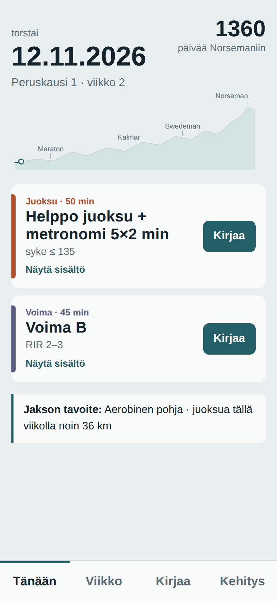
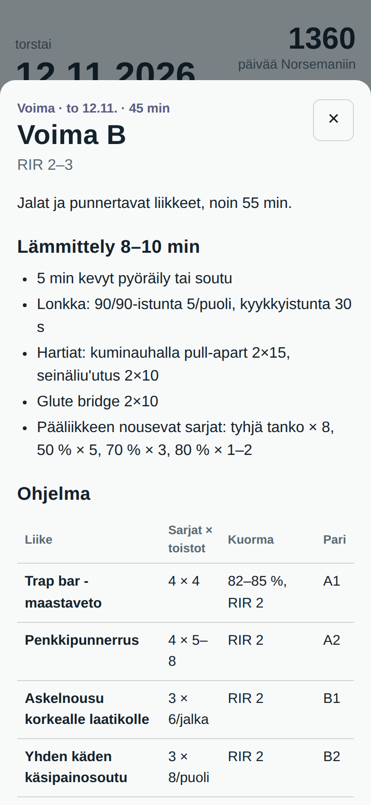
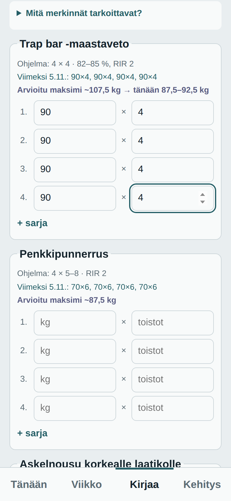
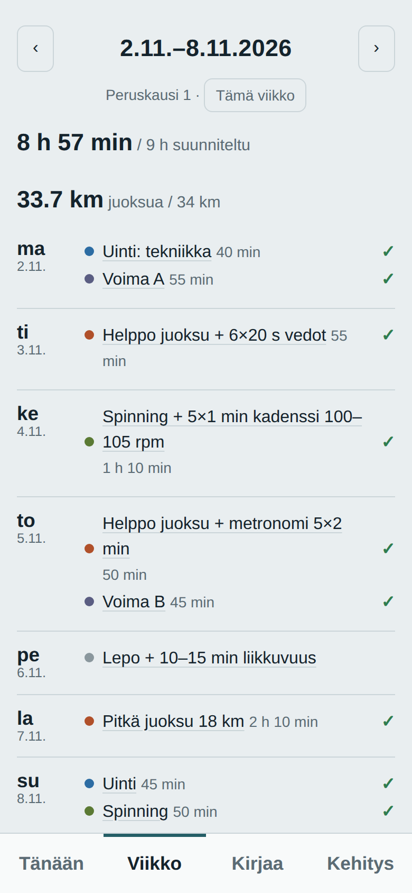
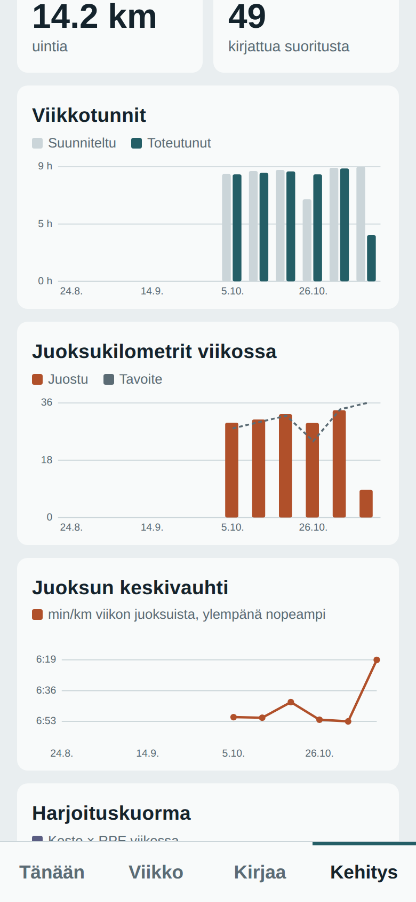
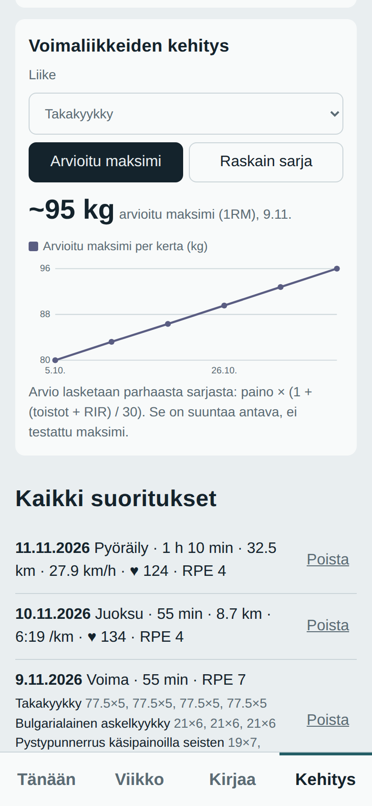

# Norseman 2030 – Training Diary

A personal training diary web app built around my multi-year plan towards the **Norseman Xtreme Triathlon** (August 2030), with my first marathon (Helsinki City Marathon, May 2027) and other key races along the way.

Every morning the app shows the day's workout from the plan. I log what I actually did, and the app turns that into progress charts. The goal is a single place for an endurance and hybrid athlete's plan, training log and progress, combining swimming, cycling, running and strength training.

> **Status:** in daily personal use. Workouts are currently logged manually. The next step is automatic data transfer from my Garmin watch (see [Planned Garmin integration](#planned-garmin-integration)).

## Screenshots

*Screenshots use sample data.*

| Today | Workout details | Strength logging |
|---|---|---|
|  |  |  |

| Week | Progress | Strength progress |
|---|---|---|
|  |  |  |

## Features

**Daily plan**
- Shows today's workouts from a training plan running from October 2026 to August 2030, with phases, 3:1 load/recovery weeks, tapers and race days.
- An elevation-profile progress bar shows where I am on the road to Norseman, with the key races marked.

**Workout content**
- Every workout opens into its full content: warm-up, main set, intensities (heart-rate zones, paces, % of max), and tips.
- Strength sessions list exercises, sets × reps, load and superset pairs, plus a glossary of the notation (RIR, % 1RM, supersets, tempo).

**Logging**
- Log a session with one tap from the plan: sport, duration, distance, average heart rate and RPE.
- The app calculates pace (min/km), speed (km/h), swim pace (/100 m) and session load (duration × RPE).
- Strength sessions are logged set by set (weight × reps). For each exercise the app shows the plan's prescription and the previous result.

**Progress**
- Weekly hours, planned vs. completed
- Weekly running distance vs. target
- Running pace trend and weekly training load
- Strength progress per exercise (heaviest working set)
- Plan adherence, totals per sport, full history and backup/restore (JSON)

**Sync**
- Data is stored in a cloud database, so the app shows the same data on my phone and computer in real time.
- Installable to the phone home screen (PWA).

## Tech stack

| Layer | Technology |
|---|---|
| Frontend | HTML, CSS, vanilla JavaScript, inline SVG charts |
| Backend / database | [Supabase](https://supabase.com) (PostgreSQL, authentication, realtime), EU region |
| Hosting | GitHub Pages |
| Security | Row Level Security: each signed-in user can only read and write their own rows; public sign-up disabled |

Developed with AI-assisted tooling (Claude).

## Architecture

```
Phone / computer  ──►  GitHub Pages (app)  ──►  Supabase
                                                 ├─ Auth (email + password)
                                                 ├─ PostgreSQL: entries table (RLS)
                                                 └─ Realtime sync between devices
```

## Planned Garmin integration

Today every workout is entered by hand, even though my Garmin watch already records it. The next step is to make the data flow automatic in both directions:

```
Garmin watch ──► Garmin Connect ──► Activity API ──► app (completed workouts logged automatically)
Training plan ──► Training API ──► Garmin Connect ──► watch (planned workouts on the wrist)
```

- **Activity API (read):** completed activities (sport, duration, distance, heart rate, laps, strength sets) are logged automatically and matched to the planned workout of the day.
- **Training API (write):** the day's planned workouts from the multi-year plan are sent to the watch, so the plan and the device stay in sync.

The app would only use the data of the athlete who has authorized it.

## Roadmap

- [x] Daily plan and workout content
- [x] Manual logging and strength sets
- [x] Progress charts and cross-device sync
- [ ] Garmin Activity API: automatic workout import
- [ ] Garmin Training API: planned workouts to the watch
- [ ] Editing the plan inside the app
- [ ] Support for other athletes and their own plans

## Author

**Joona** – ICT student (Laurea University of Applied Sciences, Finland) and endurance/hybrid athlete training for Norseman 2030.
